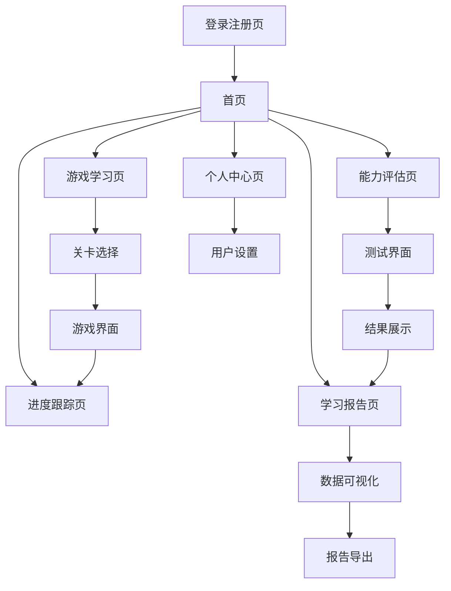

# 小学英语学习平台 - 产品需求文档

## 1. Product Overview
一个专为小学生设计的互动式英语学习平台，通过游戏化学习和智能评估系统，让英语学习变得有趣且高效。
该平台解决传统英语学习枯燥乏味的问题，为6-12岁小学生提供沉浸式的英语学习体验，帮助学生在游戏中掌握英语知识。
目标是成为国内领先的小学英语在线学习平台，服务百万小学生用户。

## 2. Core Features

### 2.1 User Roles
| Role | Registration Method | Core Permissions |
|------|---------------------|------------------|
| 学生用户 | 邮箱注册或家长代为注册 | 参与游戏学习、查看学习进度、获得积分奖励 |
| 家长用户 | 邮箱注册 | 查看孩子学习报告、设置学习目标、管理账户 |
| 教师用户 | 邀请码注册 | 创建学习任务、查看班级报告、管理学生进度 |

### 2.2 Feature Module
我们的小学英语学习平台包含以下主要页面：
1. **首页**：平台介绍、功能导航、学习进度概览
2. **游戏学习页**：互动式英语学习游戏、关卡选择、游戏界面
3. **进度跟踪页**：学习进度展示、积分系统、成就徽章
4. **能力评估页**：英语水平测试、评估结果展示
5. **学习报告页**：详细学习分析、可视化图表、进步建议
6. **个人中心页**：用户信息管理、设置选项、账户管理
7. **登录注册页**：用户认证、账户创建

### 2.3 Page Details
| Page Name | Module Name | Feature description |
|-----------|-------------|---------------------|
| 首页 | 导航栏 | 显示平台logo、主要功能入口、用户头像和登录状态 |
| 首页 | 学习概览 | 展示今日学习任务、学习进度条、积分显示 |
| 首页 | 功能卡片 | 游戏学习、能力评估、学习报告的快速入口 |
| 游戏学习页 | 关卡选择 | 显示不同难度的学习关卡、解锁状态、星级评价 |
| 游戏学习页 | 游戏界面 | 单词拼写、听力练习、语法选择等互动游戏 |
| 游戏学习页 | 实时反馈 | 答题正确性提示、积分获得动画、鼓励音效 |
| 进度跟踪页 | 学习统计 | 学习天数、完成关卡数、总积分展示 |
| 进度跟踪页 | 积分系统 | 积分获得记录、等级进度、奖励兑换 |
| 进度跟踪页 | 成就系统 | 学习徽章展示、成就解锁条件、分享功能 |
| 能力评估页 | 测试界面 | 听力、口语、阅读、写作四项能力测试 |
| 能力评估页 | 结果展示 | 能力雷达图、分项得分、能力等级评定 |
| 学习报告页 | 数据可视化 | 学习时长图表、进步趋势、知识点掌握度 |
| 学习报告页 | 详细分析 | 强项弱项分析、学习建议、下阶段目标 |
| 学习报告页 | 报告导出 | PDF报告生成、分享给家长、打印功能 |
| 个人中心页 | 用户信息 | 头像上传、昵称修改、基本信息管理 |
| 个人中心页 | 学习设置 | 学习提醒、难度调整、音效设置 |
| 登录注册页 | 用户认证 | 邮箱登录、密码找回、第三方登录 |
| 登录注册页 | 账户创建 | 用户注册、角色选择、信息完善 |

## 3. Core Process
**学生用户主要流程：**
学生登录后进入首页查看学习概览 → 选择游戏学习进入关卡 → 完成互动游戏获得积分 → 查看进度跟踪了解学习成果 → 定期进行能力评估 → 查看学习报告了解进步情况

**家长用户主要流程：**
家长登录后查看孩子学习概览 → 查看详细学习报告 → 设置学习目标和提醒 → 与孩子互动鼓励学习

## 4. User Interface Design
### 4.1 Design Style
- **主色调**：活泼的蓝色(#1890FF)和温暖的橙色(#FA8C16)
- **辅助色**：清新的绿色(#52C41A)和柔和的紫色(#722ED1)
- **按钮样式**：圆角按钮，带有轻微阴影和悬停动效
- **字体**：中文使用苹方/微软雅黑，英文使用Roboto，主要字号14px-18px
- **布局风格**：卡片式设计，顶部导航，左右布局结合
- **图标风格**：使用Ant Design图标库，配合可爱的卡通元素和动画效果

### 4.2 Page Design Overview
| Page Name | Module Name | UI Elements |
|-----------|-------------|-------------|
| 首页 | 导航栏 | 蓝色渐变背景，白色logo，圆形头像，面包屑导航 |
| 首页 | 学习概览 | 彩色进度条，数字动画效果，卡片阴影，温馨插图 |
| 游戏学习页 | 关卡选择 | 地图式关卡布局，星星评级，解锁动画，明亮色彩 |
| 游戏学习页 | 游戏界面 | 大按钮设计，即时反馈动画，鼓励性音效，可爱角色 |
| 进度跟踪页 | 积分系统 | 金币动画，等级进度条，徽章展示，彩虹色彩 |
| 能力评估页 | 测试界面 | 简洁问答布局，进度指示器，柔和背景色，清晰字体 |
| 学习报告页 | 数据可视化 | 彩色图表，动态数据展示，卡片布局，导出按钮 |

### 4.3 Responsiveness
采用移动优先的响应式设计，主要适配平板和手机设备。针对触屏操作优化按钮大小和间距，确保小学生能够轻松操作。桌面端提供更丰富的交互体验和更大的显示空间。