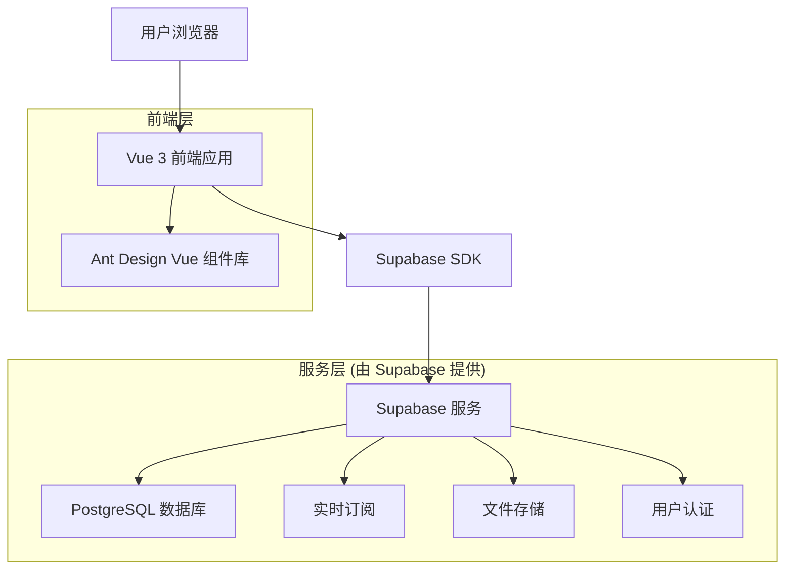
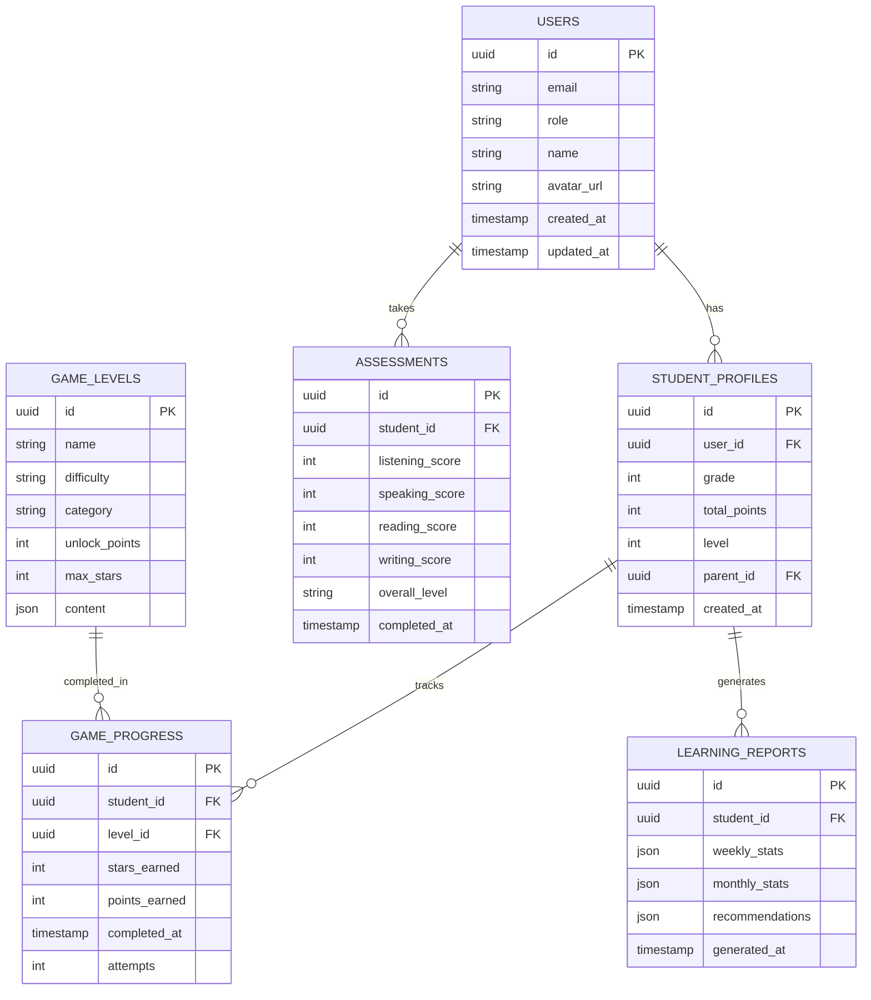

# 小学英语学习平台 - 技术架构文档

## 1. Architecture design



## 2. Technology Description

* 前端：Vue 3 + Ant Design Vue 4.x + Vite + TypeScript

* 状态管理：Pinia

* 路由：Vue Router 4

* 后端服务：Supabase (提供数据库、认证、实时功能)

* 样式：Less + Ant Design Vue 主题定制

* 图表库：Apache ECharts (用于学习数据可视化)

## 3. Route definitions

| Route              | Purpose         |
| ------------------ | --------------- |
| /                  | 首页，显示学习概览和功能导航  |
| /login             | 登录页面，用户身份验证     |
| /register          | 注册页面，新用户账户创建    |
| /games             | 游戏学习页，关卡选择和游戏界面 |
| /games/:levelId    | 具体游戏关卡页面        |
| /progress          | 进度跟踪页，学习统计和积分系统 |
| /assessment        | 能力评估页，英语水平测试    |
| /assessment/result | 评估结果展示页         |
| /reports           | 学习报告页，数据分析和可视化  |
| /profile           | 个人中心页，用户信息和设置管理 |

## 4. API definitions (Supabase 数据库交互)

### 4.1 核心数据类型

用户相关

```typescript
interface User {
  id: string;
  email: string;
  role: 'student' | 'parent' | 'teacher';
  name: string;
  avatar_url?: string;
  created_at: string;
  updated_at: string;
}

interface StudentProfile {
  id: string;
  user_id: string;
  grade: number;
  total_points: number;
  level: number;
  parent_id?: string;
  created_at: string;
}
```

学习相关

```typescript
interface GameLevel {
  id: string;
  name: string;
  difficulty: 'easy' | 'medium' | 'hard';
  category: 'vocabulary' | 'grammar' | 'listening' | 'reading';
  unlock_points: number;
  max_stars: number;
}

interface GameProgress {
  id: string;
  student_id: string;
  level_id: string;
  stars_earned: number;
  points_earned: number;
  completed_at: string;
  attempts: number;
}

interface Assessment {
  id: string;
  student_id: string;
  listening_score: number;
  speaking_score: number;
  reading_score: number;
  writing_score: number;
  overall_level: string;
  completed_at: string;
}
```

## 5. Data model

### 5.1 Data model definition



### 5.2 Data Definition Language

用户表 (users)

```sql
-- 创建用户表
CREATE TABLE users (
    id UUID PRIMARY KEY DEFAULT gen_random_uuid(),
    email VARCHAR(255) UNIQUE NOT NULL,
    role VARCHAR(20) DEFAULT 'student' CHECK (role IN ('student', 'parent', 'teacher')),
    name VARCHAR(100) NOT NULL,
    avatar_url TEXT,
    created_at TIMESTAMP WITH TIME ZONE DEFAULT NOW(),
    updated_at TIMESTAMP WITH TIME ZONE DEFAULT NOW()
);

-- 学生档案表
CREATE TABLE student_profiles (
    id UUID PRIMARY KEY DEFAULT gen_random_uuid(),
    user_id UUID REFERENCES users(id) ON DELETE CASCADE,
    grade INTEGER CHECK (grade >= 1 AND grade <= 6),
    total_points INTEGER DEFAULT 0,
    level INTEGER DEFAULT 1,
    parent_id UUID REFERENCES users(id),
    created_at TIMESTAMP WITH TIME ZONE DEFAULT NOW()
);

-- 游戏关卡表
CREATE TABLE game_levels (
    id UUID PRIMARY KEY DEFAULT gen_random_uuid(),
    name VARCHAR(100) NOT NULL,
    difficulty VARCHAR(20) CHECK (difficulty IN ('easy', 'medium', 'hard')),
    category VARCHAR(20) CHECK (category IN ('vocabulary', 'grammar', 'listening', 'reading')),
    unlock_points INTEGER DEFAULT 0,
    max_stars INTEGER DEFAULT 3,
    content JSONB,
    created_at TIMESTAMP WITH TIME ZONE DEFAULT NOW()
);

-- 游戏进度表
CREATE TABLE game_progress (
    id UUID PRIMARY KEY DEFAULT gen_random_uuid(),
    student_id UUID REFERENCES student_profiles(id) ON DELETE CASCADE,
    level_id UUID REFERENCES game_levels(id) ON DELETE CASCADE,
    stars_earned INTEGER DEFAULT 0 CHECK (stars_earned >= 0 AND stars_earned <= 3),
    points_earned INTEGER DEFAULT 0,
    completed_at TIMESTAMP WITH TIME ZONE DEFAULT NOW(),
    attempts INTEGER DEFAULT 1,
    UNIQUE(student_id, level_id)
);

-- 能力评估表
CREATE TABLE assessments (
    id UUID PRIMARY KEY DEFAULT gen_random_uuid(),
    student_id UUID REFERENCES student_profiles(id) ON DELETE CASCADE,
    listening_score INTEGER CHECK (listening_score >= 0 AND listening_score <= 100),
    speaking_score INTEGER CHECK (speaking_score >= 0 AND speaking_score <= 100),
    reading_score INTEGER CHECK (reading_score >= 0 AND reading_score <= 100),
    writing_score INTEGER CHECK (writing_score >= 0 AND writing_score <= 100),
    overall_level VARCHAR(20),
    completed_at TIMESTAMP WITH TIME ZONE DEFAULT NOW()
);

-- 学习报告表
CREATE TABLE learning_reports (
    id UUID PRIMARY KEY DEFAULT gen_random_uuid(),
    student_id UUID REFERENCES student_profiles(id) ON DELETE CASCADE,
    weekly_stats JSONB,
    monthly_stats JSONB,
    recommendations JSONB,
    generated_at TIMESTAMP WITH TIME ZONE DEFAULT NOW()
);

-- 创建索引
CREATE INDEX idx_student_profiles_user_id ON student_profiles(user_id);
CREATE INDEX idx_game_progress_student_id ON game_progress(student_id);
CREATE INDEX idx_game_progress_completed_at ON game_progress(completed_at DESC);
CREATE INDEX idx_assessments_student_id ON assessments(student_id);
CREATE INDEX idx_learning_reports_student_id ON learning_reports(student_id);

-- 设置 RLS (Row Level Security) 策略
ALTER TABLE users ENABLE ROW LEVEL SECURITY;
ALTER TABLE student_profiles ENABLE ROW LEVEL SECURITY;
ALTER TABLE game_progress ENABLE ROW LEVEL SECURITY;
ALTER TABLE assessments ENABLE ROW LEVEL SECURITY;
ALTER TABLE learning_reports ENABLE ROW LEVEL SECURITY;

-- 基本权限设置
GRANT SELECT ON game_levels TO anon;
GRANT ALL PRIVILEGES ON users TO authenticated;
GRANT ALL PRIVILEGES ON student_profiles TO authenticated;
GRANT ALL PRIVILEGES ON game_progress TO authenticated;
GRANT ALL PRIVILEGES ON assessments TO authenticated;
GRANT ALL PRIVILEGES ON learning_reports TO authenticated;

-- 初始化游戏关卡数据
INSERT INTO game_levels (name, difficulty, category, unlock_points, content) VALUES
('字母认知', 'easy', 'vocabulary', 0, '{"words": ["apple", "ball", "cat"], "type": "letter_match"}'),
('基础单词', 'easy', 'vocabulary', 50, '{"words": ["dog", "egg", "fish"], "type": "word_spell"}'),
('简单语法', 'medium', 'grammar', 100, '{"rules": ["be动词", "单复数"], "type": "grammar_choice"}'),
('听力练习', 'medium', 'listening', 150, '{"audio_files": ["hello.mp3", "goodbye.mp3"], "type": "audio_match"}'),
('阅读理解', 'hard', 'reading', 200, '{"passages": ["short_story_1"], "type": "reading_comprehension"}');
```

